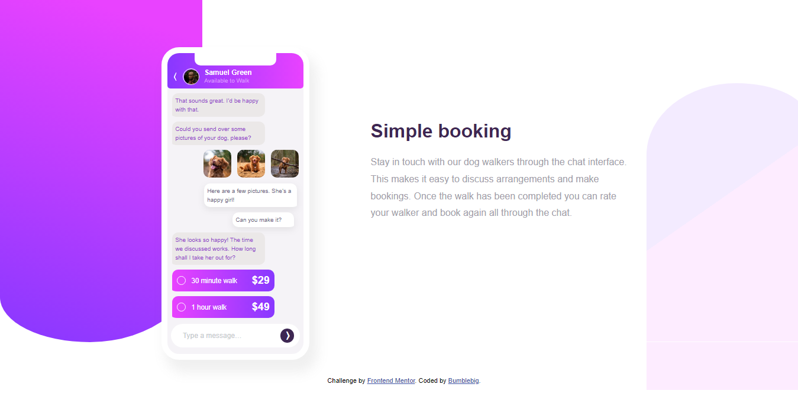

# Frontend Mentor - Chat app CSS illustration solution

This is a solution to the [Chat app CSS illustration challenge on Frontend Mentor](https://www.frontendmentor.io/challenges/chat-app-css-illustration-O5auMkFqY).

## Table of contents

- [Overview](#overview)
  - [The challenge](#the-challenge)
  - [Screenshot](#screenshot)
  - [Links](#links)
- [My process](#my-process)
  - [Built with](#built-with)
- [Author](#author)

## Overview

### The challenge

Users should be able to:

- View the optimal layout for the component depending on their device's screen size
- **Bonus**: See the chat interface animate on the initial load

### Screenshot

### Links

- Solution URL: [My Solution](https://github.com/Bumblebig/Frontend-mentor-solutions/tree/main/chat-app-css-illustration-master)
- Live Site URL: [Live Site](https://bumblebig.github.io/Frontend-mentor-solutions/chat-app-css-illustration-master/)

## My process

### Built with

- Semantic HTML5 markup
- CSS custom properties
- Flexbox

## Author

- GitHub - [@Bumblebig](https://www.github.com/Bumblebig)
- Frontend Mentor - [@Bumblebig](https://www.frontendmentor.io/profile/Bumblebig)
- Twitter - [@RealCecil4](https://www.twitter.com/RealCecil4)
