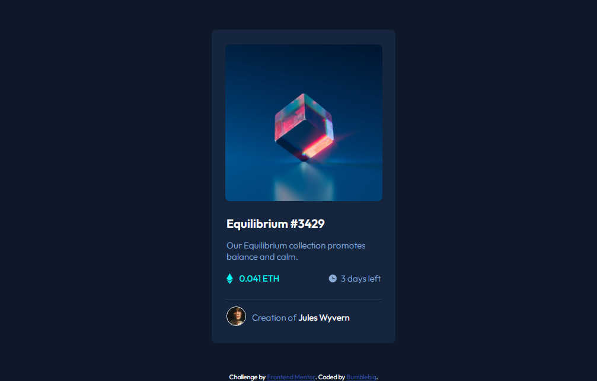

# Frontend Mentor - NFT preview card component solution

This is a solution to the [NFT preview card component challenge on Frontend Mentor](https://www.frontendmentor.io/challenges/nft-preview-card-component-SbdUL_w0U). Frontend Mentor challenges help you improve your coding skills by building realistic projects. 

## Table of contents

- [Overview](#overview)
  - [The challenge](#the-challenge)
  - [Screenshot](#screenshot)
  - [Links](#links)
- [My process](#my-process)
  - [Built with](#built-with)
- [Author](#author)

## Overview

### The challenge

Users should be able to:

- View the optimal layout depending on their device's screen size
- See hover states for interactive elements

### Screenshot

### Links

- Solution URL: [My Solution](https://github.com/Bumblebig/Frontend-mentor-solutions/nft-preview-card-component-main)
- Live Site URL: [Live Site](https://bumblebig.github.io/frontend-mentor-solutions/nft-preview-card-component-main/)

## My process

### Built with

- Semantic HTML5 markup
- CSS custom properties
- Flexbox
- CSS Grid
- Mobile-first workflow

## Author

- GitHub - [@Bumblebig](https://www.github.com/Bumblebig)
- Frontend Mentor - [@Bumblebig](https://www.frontendmentor.io/profile/Bumblebig)
- Twitter - [@RealCecil4](https://www.twitter.com/RealCecil4)

