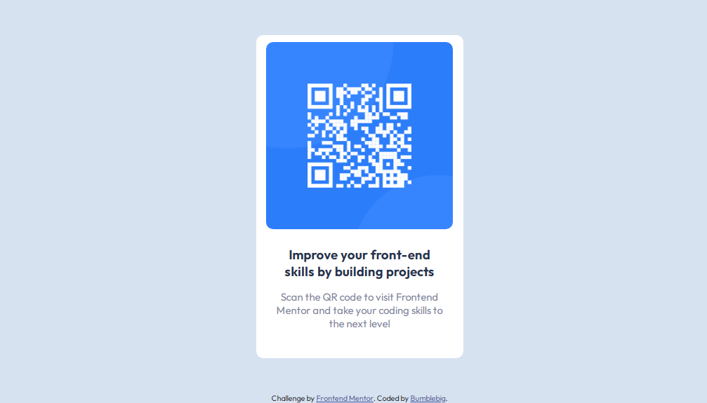

# Frontend Mentor - QR code component solution

This is a solution to the [QR code component challenge on Frontend Mentor](https://www.frontendmentor.io/challenges/qr-code-component-iux_sIO_H). 

## Table of contents

- [Overview](#overview)
  - [Screenshot](#screenshot)
  - [Links](#links)
- [My process](#my-process)
  - [Built with](#built-with)
- [Author](#author)

## Overview

### Screenshot

### Links

- Solution URL: [My Solution](https://github.com/Bumblebig/Frontend-mentor-solutions/tree/main/qr-code-component-main)
- Live Site URL: [Live Site](https://bumblebig.github.io/Frontend-mentor-solutions/qr-code-component-main/)

## My process

### Built with

- Semantic HTML5 markup
- CSS custom properties

## Author

- GitHub - [@Bumblebig](https://www.github.com/Bumblebig)
- Frontend Mentor - [@Bumblebig](https://www.frontendmentor.io/profile/Bumblebig)
- Twitter - [@RealCecil4](https://www.twitter.com/RealCecil4)
